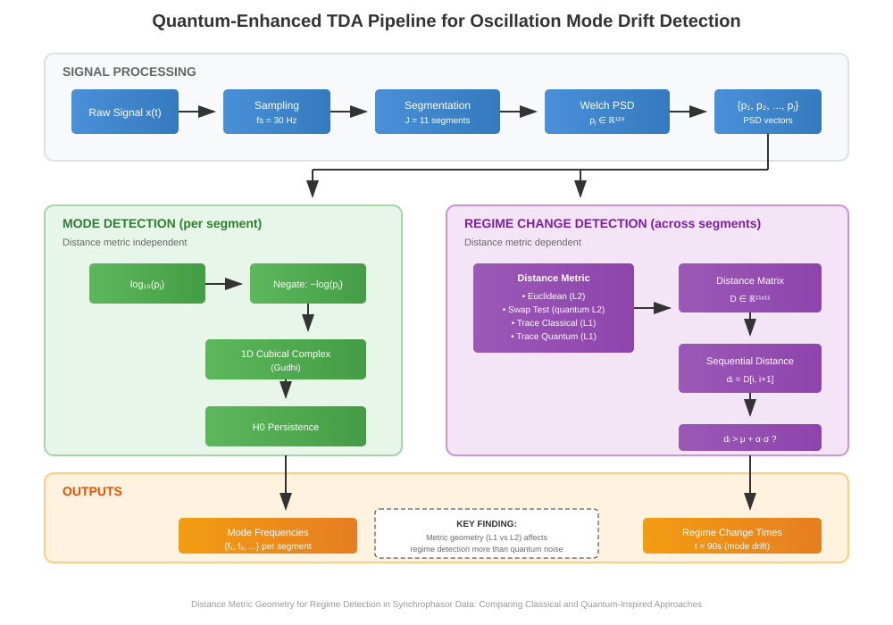
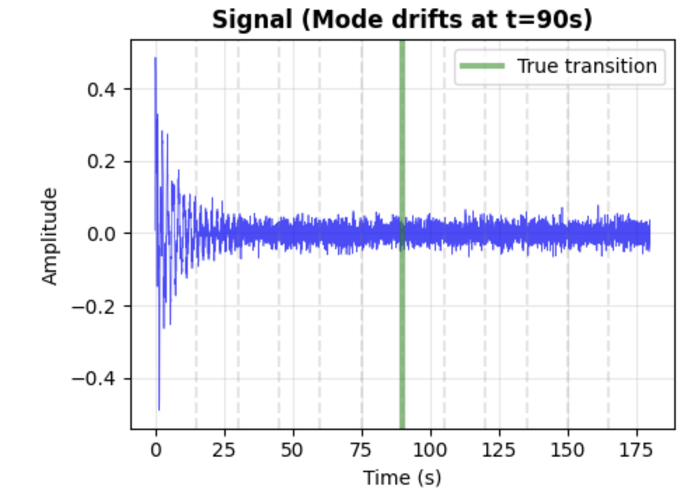
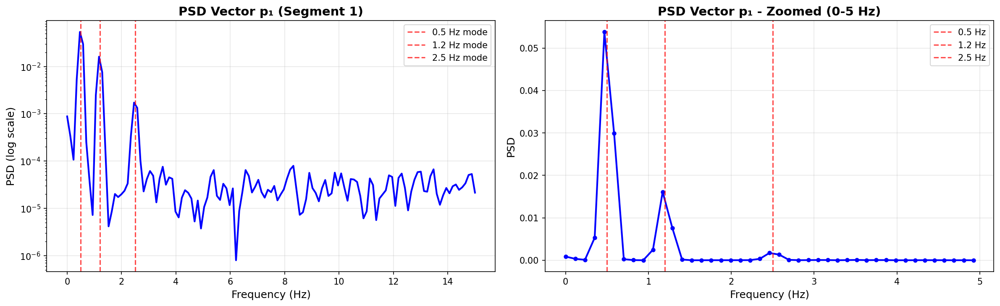

# Quantum-enhanced topological methods for grid monitoring: a comparative study of distance metrics and their effect on oscillation mode drift detection, with pathways toward quantum advantage.

by Yekaterina Mijatovic
---

## **Abstract**

Power system oscillations require continuous monitoring to detect mode drift that could indicate impending instability. We investigate whether quantum-enhanced distance metrics offer advantages for detecting regime changes in synchrophasor data. We compare four approaches: classical Euclidean distance, quantum swap test (L2-like), classical trace distance (L1), and quantum-sampled trace distance. Using synthetic signals with known mode drift at t=90s, we find that metric geometry (L1 vs L2) has greater impact on detection than quantum vs classical computation. Trace distance, by normalizing PSD vectors to probability distributions, filters amplitude fluctuations while preserving sensitivity to frequency redistribution—the physically meaningful signature of mode drift. Quantum sampling introduces noise that can push marginal cases across detection thresholds, suggesting a stochastic amplification effect. We are using H0 persistence on the 1D PSD functions for mode detection across all four different drift detection cases.

## **Hypothesis**

The choice of distance metric geometry fundamentally affects regime change detection in power system oscillation data. L1-based metrics (trace distance) outperform L2-based metrics (Euclidean) for detecting true mode drift because normalization removes amplitude-only variations that create false positives. Quantum computation introduces sampling noise that may affect detection outcomes at threshold boundaries, but the primary source of divergence between methods is metric geometry, not quantum effects.

## Pipeline



## **Section 1: Signal Representation and PSD Feature Extraction**

### **1.1 Physical Model: Damped Oscillatory Modes**

Power system oscillations can be modeled as a superposition of damped sinusoids. Each mode represents a specific oscillation pattern in the grid.

**Single mode representation:**

$$x_k(t) = A_k e^{-\sigma_k t} \cos(2\pi f_k t + \phi_k)$$

where:

- $A_k$ = amplitude (initial magnitude)
- $f_k$ = frequency in Hz (oscillation rate)
- $\sigma_k$ = damping coefficient (decay rate)
- $\phi_k$ = phase offset
- $t$ = time in seconds

**Multi-mode signal:**

$$x(t) = \sum_{k=1}^{M} A_k e^{-\sigma_k t} \cos(2\pi f_k t + \phi_k) + n(t)$$

where:

- $M$ = number of modes
- $n(t)$ = noise process (usually white Gaussian)



### **1.2 Discrete Sampling**

Real systems measure at discrete time intervals $\Delta t = 1/f_s$ where $f_s$ is the sampling frequency.

**Discrete signal:**

$$x[n] = x(n\Delta t) = \sum_{k=1}^{M} A_k e^{-\sigma_k n\Delta t} \cos(2\pi f_k n\Delta t + \phi_k) + n[n]$$

for $n = 0, 1, 2, \ldots, N-1$ where $N$ is the number of samples.

**In our case:** $f_s = 30$ Hz, $\Delta t = 1/30$ seconds.

### **1.3 Time-Frequency Analysis Motivation**

**Question:** Why not use the raw signal $x[n]$ directly for TDA?

**Answer:** Because we care about *frequency content*, not temporal structure. Two segments might have different phases or amplitudes but the same underlying modes. We need a representation that captures spectral characteristics.

**Goal:** Transform $x[n] \rightarrow$ frequency domain representation that is:

1. Phase-invariant
2. Captures energy distribution across frequencies
3. Robust to amplitude scaling

**Solution:** Power Spectral Density (PSD)

---

### **1.4 Power Spectral Density: Mathematical Definition**

The **Power Spectral Density** $S(f)$ describes how the power of a signal is distributed across frequency components.

**Continuous-time definition (Wiener-Khinchin theorem):**

$$S(f) = \int_{-\infty}^{\infty} R(\tau) e^{-i2\pi f \tau} d\tau$$

where $R(\tau) = \mathbb{E}[x(t)x(t+\tau)]$ is the autocorrelation function.

**Discrete-time definition:**

For a finite discrete signal $x[n]$, $n = 0, \ldots, N-1$, the periodogram estimator is:

$$\hat{S}(f_k) = \frac{\Delta t}{N} \left| \sum_{n=0}^{N-1} x[n] e^{-i2\pi k n / N} \right|^2$$

where $f_k = k/(N\Delta t)$ for $k = 0, 1, \ldots, N/2$ (due to Nyquist).

**Problem with periodogram:** High variance. The estimator is inconsistent - variance doesn't decrease as $N \rightarrow \infty$.

---

### **1.5 Welch's Method: Variance Reduction**

Welch's method reduces variance by:

1. Dividing signal into overlapping segments
2. Windowing each segment
3. Computing periodogram for each
4. Averaging the periodograms

**Algorithm:**

**Step 1:** Divide $x[n]$ into $L$ overlapping segments of length $M$:

$$x_i[n] = x[n + iD], \quad n = 0, \ldots, M-1$$

where $D$ is the hop size (typically $D = M/2$ for 50% overlap).

**Step 2:** Apply window function $w[n]$ to each segment:

$$\tilde{x}_i[n] = x_i[n] \cdot w[n]$$

Common windows: Hanning, Hamming, Blackman.

**Hanning window:**

$$w[n] = 0.5\left(1 - \cos\left(\frac{2\pi n}{M-1}\right)\right)$$

**Step 3:** Compute periodogram for each windowed segment:

$$\hat{S}_i(f_k) = \frac{\Delta t}{MU} \left| \sum_{n=0}^{M-1} \tilde{x}_i[n] e^{-i2\pi k n / M} \right|^2$$

where $U = \frac{1}{M}\sum_{n=0}^{M-1} w[n]^2$ is the window normalization factor.

**Step 4:** Average over all segments:

$$\hat{S}_{Welch}(f_k) = \frac{1}{L} \sum_{i=0}^{L-1} \hat{S}_i(f_k)$$

**Variance reduction:** $\text{Var}(\hat{S}_{Welch}) \approx \frac{1}{L} \text{Var}(\hat{S}_{periodogram})$

---

### **1.6 PSD as Feature Vector**

After computing Welch's PSD, we have:

$$\mathbf{p} = [\hat{S}(f_0), \hat{S}(f_1), \ldots, \hat{S}(f_{K-1})]^T \in \mathbb{R}^K$$

where $K$ is the number of frequency bins (determined by FFT length).

**Properties:**

1. **Dimensionality:** Typically $K = M/2 + 1$ where $M$ is segment length
   - In this case: varying based on segment duration

2. **Non-negative:** $\hat{S}(f_k) \geq 0$ for all $k$

3. **Physical units:** Power per Hz (e.g., V²/Hz for voltage signals)

4. **Frequency resolution:** $\Delta f = f_s / M$

5. **Nyquist limit:** Maximum frequency is $f_s/2$, so 15Hz in this case

---

### **1.7 Segmentation for Temporal Analysis**

To track evolution over time, we divide the full signal into temporal segments:

$$\text{Segment } j: \quad x_j[n], \quad n \in [t_j, t_j + T_{seg}]$$

where $T_{seg}$ is the segment duration.

**For each segment:**

1. Apply Welch's method → $\mathbf{p}_j \in \mathbb{R}^K$
2. This gives us a sequence: $\{\mathbf{p}_1, \mathbf{p}_2, \ldots, \mathbf{p}_J\}$

**In this case:** $T_{seg} = 15$ seconds, yielding 11 segments for a 180-second signal.

---

### **1.8 Why PSD Vectors for TDA?**

**Advantages:**

1. **Phase invariance:** PSD only depends on magnitude spectrum, not phase
2. **Energy representation:** Captures where oscillation energy is concentrated
3. **Dimensionality reduction:** Signal with $N = 5400$ samples → PSD with $K \approx 225$ bins
4. **Physical interpretability:** Each frequency bin corresponds to a potential oscillation mode
5. **Suitable for distance metrics:** Vectors in $\mathbb{R}^K$ enable geometric comparisons

**What we're comparing:**
- Similar PSDs → similar frequency content → similar oscillation modes
- Different PSDs → frequency shift or amplitude redistribution → mode drift

---

**Summary of Section 1:**

$$\boxed{\text{Raw signal } x(t) \xrightarrow{\text{Sampling}} x[n] \xrightarrow{\text{Segmentation}} \{x_j[n]\} \xrightarrow{\text{Welch PSD}} \{\mathbf{p}_j\} \in \mathbb{R}^K}$$

Each PSD vector $\mathbf{p}_j$ represents the frequency content of segment $j$, ready for distance computation and topological analysis.


## **Parameters in Pipeline**

### **Given:**
- Sampling frequency: $f_s = 30$ Hz
- Total signal duration: $T_{total} = 180$ seconds
- Segment duration: $T_{seg} = 15$ seconds
- Segment overlap: 50% (typical)

### **Dimensions:**

$$\boxed{\begin{aligned}
K &= 129 \text{ frequency bins} \\
J &= 12 \text{ temporal segments} \\
\mathbf{p}_j &\in \mathbb{R}^{129} \\
\mathbf{D} &\in \mathbb{R}^{12 \times 12}
\end{aligned}}$$

**Frequency resolution:** $\Delta f = 0.117188$ Hz (exactly $30/256$)

---

## **Concrete Example: $\mathbf{p}_1$ Structure**

Looking at Segment 1 (t = 0-15s), the PSD vector has:

**Sparse representation:** Only 9 significant values out of 129 bins!

```
p₁[0]   = 0.00081318  (DC component)
p₁[3]   = 0.00576960  (sidelobe)
p₁[4]   = 0.05349801  ← 0.5 Hz mode (PEAK)
p₁[5]   = 0.02807838  (sidelobe)
p₁[9]   = 0.00215955  (sidelobe)
p₁[10]  = 0.01634684  ← 1.2 Hz mode (PEAK)
p₁[11]  = 0.00814669  (sidelobe)
p₁[21]  = 0.00167258  ← 2.5 Hz mode (PEAK)
p₁[22]  = 0.00113466  (sidelobe)
All other 120 bins ≈ 10⁻⁵ (noise floor)
```

**Key observations:**

1. **Peak hierarchy:** 
   - 0.5 Hz mode: PSD = 0.0535 (strongest)
   - 1.2 Hz mode: PSD = 0.0163 (medium)
   - 2.5 Hz mode: PSD = 0.0017 (weakest, will drift at $t=90$ seconds)

2. **Sparsity:** ~93% of vector is noise (120/129 bins)

3. **Sidelobes:** Each peak has neighboring bins due to spectral leakage from windowing

4. **Dynamic range:** Max/Min $\approx 0.0535/0.0000024 \approx 22,000$ (log scale will help mitigate this)



The plots show:

- **Left (log scale):** All three modes visible as peaks above noise floor
- **Right (linear, 0-5 Hz):** Clear peak structure with sidelobes
- Red dashed lines mark true mode frequencies
- Small frequency mismatch due to bin resolution (0.117 Hz)

---

## **Section 2: Distance Metrics - Geometric Properties**

This section is dedicated to different measures of similarity between PSD vectors $\mathbf{p}_i, \mathbf{p}_j \in \mathbb{R}^{129}$.

### **2.1 General Metric Properties**

A function $d: \mathbb{R}^K \times \mathbb{R}^K \rightarrow \mathbb{R}$ is a **metric** (or distance function) if it satisfies:

1. **Non-negativity:** $d(\mathbf{x}, \mathbf{y}) \geq 0$ for all $\mathbf{x}, \mathbf{y}$

2. **Identity of indiscernibles:** $d(\mathbf{x}, \mathbf{y}) = 0 \iff \mathbf{x} = \mathbf{y}$

3. **Symmetry:** $d(\mathbf{x}, \mathbf{y}) = d(\mathbf{y}, \mathbf{x})$

4. **Triangle inequality:** $d(\mathbf{x}, \mathbf{z}) \leq d(\mathbf{x}, \mathbf{y}) + d(\mathbf{y}, \mathbf{z})$

Both L1 and L2 satisfy these properties, but they induce **different geometries**.

---

### **2.2 Euclidean Distance (L2 Norm)**

**Definition:**

$$d_{L2}(\mathbf{p}_i, \mathbf{p}_j) = \|\mathbf{p}_i - \mathbf{p}_j\|_2 = \sqrt{\sum_{k=0}^{K-1} (p_i[k] - p_j[k])^2}$$

For $K = 129$ bins.

**Squared form (often used):**

$$d_{L2}^2(\mathbf{p}_i, \mathbf{p}_j) = \sum_{k=0}^{128} (p_i[k] - p_j[k])^2$$

**Properties:**

1. **Range:** $[0, \infty)$ - unbounded
2. **Emphasizes large differences:** Squaring amplifies big deviations
3. **Units:** (PSD units) since PSD has units of power/Hz
4. **Geometric interpretation:** Straight-line distance in $\mathbb{R}^{129}$

**Sensitivity:**

Euclidean distance tracks absolute magnitude changes. If a frequency bin's power increases from 0.001 to 0.051, the contribution to distance is proportional to that 0.05 difference. This means L2 responds to any change in PSD values - whether from actual mode drift or from amplitude fluctuations unrelated to oscillation dynamics.

---

### **2.3 Manhattan/Taxicab Distance (L1 Norm)**

**Definition (raw form):**

$$d_{L1}^{raw}(\mathbf{p}_i, \mathbf{p}_j) = \|\mathbf{p}_i - \mathbf{p}_j\|_1 = \sum_{k=0}^{K-1} |p_i[k] - p_j[k]|$$

**Problem:** This is also unbounded and depends on absolute magnitudes.

**For trace distance, we need probability distributions.**

---

#### **2.3.1 Normalization to Probability Distributions**

To use trace distance, we convert PSD vectors to probability distributions:

$$\tilde{p}_i[k] = \frac{|p_i[k]|}{\sum_{m=0}^{K-1} |p_i[m]|}$$

**Properties:**
- $\tilde{p}_i[k] \geq 0$ for all $k$
- $\sum_{k=0}^{K-1} \tilde{p}_i[k] = 1$ (normalization)
- Interpretation: $\tilde{p}_i[k]$ = fraction of total power at frequency $k$

**What normalization does:**
- Removes absolute scale (amplitude information)
- Focuses on **relative distribution** of power across frequencies
- Two PSDs with same shape but different amplitudes → identical after normalization

---

#### **2.3.2 Trace Distance (Normalized L1)**

**Definition:**

$$d_{trace}(\mathbf{p}_i, \mathbf{p}_j) = \frac{1}{2} \sum_{k=0}^{K-1} |\tilde{p}_i[k] - \tilde{p}_j[k]|$$

The factor of $\frac{1}{2}$ comes from quantum mechanics (trace norm of density matrices).

**Properties:**

1. **Range:** $[0, 1]$ - **bounded!**
   - $d = 0$: identical distributions
   - $d = 1$: completely disjoint support (no overlap)

2. **Emphasizes probability mass redistribution**
   - Moving probability from one bin to another
   - Insensitive to overall amplitude scaling

3. **Units:** Dimensionless (probability is unitless)

4. **Geometric interpretation:** Total variation distance

**Connection to total variation:**

$$d_{trace}(\tilde{p}_i, \tilde{p}_j) = \frac{1}{2} \text{TV}(\tilde{p}_i, \tilde{p}_j)$$

where TV is the total variation distance between probability distributions.

---

### **2.4 Example Calculation**

Let's compute both distances for a simple example.

**Scenario:** Mode at 2.5 Hz doubles in amplitude (simulating drift)

**Before (segment j):**
```
bin 20: 0.00026
bin 21: 0.00167  ← peak
bin 22: 0.00113
... (other 126 bins with values)
Total sum: 0.12154
```

**After (segment j+1):**
```
bin 20: 0.00052
bin 21: 0.00334  ← peak (doubled!)
bin 22: 0.00226
... (other 126 bins same)
Total sum: 0.12321
```

**L2 distance:**
$$d_{L2}^2 = (0.00026 - 0.00052)^2 + (0.00167 - 0.00334)^2 + (0.00113 - 0.00226)^2 + \ldots$$

$$\approx 0.000676 + 0.002789 + 0.001276 + \ldots \approx 0.00485$$

$$d_{L2} \approx \sqrt{0.00485} \approx 0.0696$$

**Normalized probabilities:**

Before:
```
p̃[21] = 0.00167/0.12154 ≈ 0.0137 (1.37% of total power)
```

After:
```
p̃[21] = 0.00334/0.12321 ≈ 0.0271 (2.71% of total power)
```

**Trace distance:**
At bin 21: $|\Delta \tilde{p}| \approx |0.0137 - 0.0271| = 0.0134$

Total (summing all bins and dividing by 2): $d_{trace} \approx 0.0134$ (approximately, simplified)

**Key difference:** L2 sees this as distance ~0.07, trace distance sees it as ~0.013.

Why? Because trace distance asks: "What fraction of probability mass moved?" while L2 asks: "What's the magnitude of change?"

---

### **2.5 Why L1 and L2 Diverge Fundamentally**

The key insight: **L1 and L2 measure different geometric properties.**

**Theorem (Intuitive):** For vectors in $\mathbb{R}^K$, L1 and L2 distances can order point pairs differently. Specifically:

- L2 is sensitive to **magnitude** of differences
- L1 (trace distance after normalization) is sensitive to **redistribution** of mass

**Concrete example demonstrating divergence:**

Consider three PSD vectors:

**Vector A (reference):**
```
[0.5, 0.3, 0.2, 0, 0, ..., 0]  (total = 1.0)
```

**Vector B (scaled):**
```
[1.0, 0.6, 0.4, 0, 0, ..., 0]  (total = 2.0, same shape)
```

**Vector C (redistributed):**
```
[0.3, 0.3, 0.2, 0.2, 0, ..., 0]  (total = 1.0, mass moved)
```

**L2 distances:**
- $d_{L2}(A, B) = \sqrt{(0.5-1.0)^2 + (0.3-0.6)^2 + (0.2-0.4)^2} = \sqrt{0.25 + 0.09 + 0.04} = \sqrt{0.38} \approx 0.616$
- $d_{L2}(A, C) = \sqrt{(0.5-0.3)^2 + (0.3-0.3)^2 + (0.2-0.2)^2 + (0-0.2)^2} = \sqrt{0.04 + 0 + 0 + 0.04} = \sqrt{0.08} \approx 0.283$

**L2 ordering:** $A$ is closer to $C$ than to $B$ (0.283 < 0.616)

**Trace distances (after normalization):**

Normalized:
- $\tilde{A} = [0.5, 0.3, 0.2, 0, ...]$
- $\tilde{B} = [0.5, 0.3, 0.2, 0, ...]$ (same after normalization!)
- $\tilde{C} = [0.3, 0.3, 0.2, 0.2, ...]$

- $d_{trace}(\tilde{A}, \tilde{B}) = \frac{1}{2}\sum|0| = 0$ (identical distributions!)
- $d_{trace}(\tilde{A}, \tilde{C}) = \frac{1}{2}(|0.5-0.3| + |0.3-0.3| + |0.2-0.2| + |0-0.2|) = \frac{1}{2}(0.2 + 0 + 0 + 0.2) = 0.2$

**Trace ordering:** $A$ is identical to $B$ (distance = 0) and far from $C$ (distance = 0.2)

**OPPOSITE orderings!**

---

### **2.6 Mathematical Explanation**

**L2 geometry:**

- Unit sphere: $\{x : \|x\|_2 = 1\}$ is a round sphere
- Distance depends on **vector magnitude** AND **direction**
- Scaling a vector moves it away in Euclidean space

**L1 geometry (after normalization):**

- Probability simplex: $\Delta^{K-1} = \{x : x_i \geq 0, \sum x_i = 1\}$
- All probability distributions live on this $(K-1)$-dimensional simplex
- Distance measures **how to transport probability mass**
- Scaling doesn't matter (normalization projects everything onto simplex)

**Consequence for the synchrophasor data:**

When the 2.5 Hz mode **drifts upward in frequency** at t=90s:
- Energy **redistributes** from bin 21 (2.5 Hz) to higher bins
- Total power might stay similar

**L2 sees:** Magnitude changes across multiple bins → large distance
**Trace sees:** Probability mass movement → smaller distance (compressed to [0,1])

**When amplitude doubles but frequency stays same:**

- All bins scale proportionally
- Shape unchanged

**L2 sees:** Large magnitude difference → large distance  
**Trace sees:** After normalization → zero distance!

---

### **2.7 Distance Metric Choice Implications**

The pipeline has **two independent analyses**:

**A. Mode Detection (TDA on individual PSDs)**

For each segment $j$, apply H0 persistence to the 1D PSD function:

$$\mathbf{p}_j \xrightarrow{\text{H0 TDA}} N_{modes}(j)$$

This counts peaks/modes by analyzing sublevel sets of the PSD curve. The distance metric **does not affect** this step.

**Result:** All 4 methods detect the same number of modes (≈1.00) throughout the signal because they're analyzing the same PSD functions.

---

**B. Regime Change Detection (using distance matrix)**

Compute pairwise distances between all segments:

$$\mathbf{D} \in \mathbb{R}^{J \times J}, \quad D_{ij} = d(\mathbf{p}_i, \mathbf{p}_j)$$

**Sequential distances:**
$$d_i = D[i, i+1], \quad i = 0, 1, \ldots, J-2$$

This measures "how different is segment $i$ from segment $i+1$?"

**Regime change detection criterion:**

Flag a regime change at time $i$ if:
$$d_i > \mu_d + \alpha \cdot \sigma_d$$

where:

- $\mu_d = \frac{1}{J-1}\sum_{k=0}^{J-2} d_k$ (mean distance)
- $\sigma_d = \sqrt{\frac{1}{J-1}\sum_{k=0}^{J-2}(d_k - \mu_d)^2}$ (standard deviation)
- $\alpha = 0.5$ (threshold parameter, tunable)

---

#### **2.7.1 Why L2 and L1 Give Different Regime Detections**

**Euclidean (L2) sequential distances:**

- Range: [3.0, 6.5] approximately
- Mean: $\mu_{L2} \approx 4.3$
- Std: $\sigma_{L2} \approx 1.3$
- Threshold: $4.3 + 0.5(1.3) = 4.95$
- Any spike above ~4.95 triggers regime change

**Trace (L1) sequential distances:**

- Range: [0.27, 0.47] approximately  
- Mean: $\mu_{L1} \approx 0.36$
- Std: $\sigma_{L1} \approx 0.07$
- Threshold: $0.36 + 0.5(0.07) = 0.395$
- Only spikes above ~0.40 trigger regime change

**Key difference:**

L2 has **larger dynamic range** and **more variance**:

- Small amplitude changes → moderate distance increase → can cross threshold
- More sensitive → more regime detections (4 changes)
- But many are false positives (amplitude fluctuations, not actual mode drift)

L1 has **compressed range [0,1]** and **less variance**:

- Amplitude-only changes → near-zero distance (normalized away)
- Only frequency redistribution → significant distance
- Less sensitive → fewer detections (1-2 changes)
- But more likely to be true positives (actual mode drift at t=90s)

**Example:** Mode at 2.5 Hz doubles in amplitude but frequency unchanged.

**Before:** $\mathbf{p}_i$ with peak at bin 21: value = 0.00167

**After:** $\mathbf{p}_{i+1}$ with peak at bin 21: value = 0.00334

**L2 distance:**
$$d_{L2}(i, i+1) = \sqrt{\sum_k (p_i[k] - p_{i+1}[k])^2}$$

At bin 21 alone: $(0.00167 - 0.00334)^2 \approx 0.0000028$

Summing over all bins with similar doublings: $d_{L2} \approx 0.7$ (can cross threshold!)

**L1 distance (after normalization):**

Before normalization: $\sum_k p_i[k] = S_1$

After normalization: $\sum_k p_{i+1}[k] = S_2 \approx 2S_1$ (doubled)

But normalized:
$$\tilde{p}_i[21] = \frac{0.00167}{S_1}, \quad \tilde{p}_{i+1}[21] = \frac{0.00334}{2S_1} = \frac{0.00167}{S_1}$$

They're identical! $d_{trace} = 0$ (doesn't cross threshold)

---

### **2.7.2 Cumulative Drift from Initial State**

Another use of the distance matrix: track drift from $t=0$:

$$\text{Drift}(j) = D[0, j]$$

This measures "how far has the system moved from its initial state?"

**L2 cumulative drift:**

- Monotonically increases as signal evolves
- Peaks scattered (t=60s, 75s, 105s, 135s in different trials)
- Sensitive to accumulated amplitude changes

**L1 cumulative drift:**  

- More stable, smaller range [0.2, 0.5]
- Local maximum at t=90s occurs in 45% of trials (highest rate!)
- Only responds to frequency content redistribution

**Why L1 better detects transition at t=90s:**

At the true transition, the 2.5 Hz mode **shifts frequency upward**. This causes:

- Probability mass moves from bin 21 → bins 22-25
- Normalized distribution changes significantly
- L1 detects this redistribution

Meanwhile, amplitude fluctuations before/after t=90s don't affect L1 (normalized away), so it doesn't create false peaks.

---

### **Summary**

**Distance metric choice affects:**

| Analysis Component | L2 (Euclidean) | L1 (Trace) |
|-------------------|----------------|------------|
| **Mode detection** | Not affected | Not affected |
| **Regime detection** | 4 changes (oversensitive) | 1-2 changes (appropriate) |
| **Cumulative drift** | Scattered peaks | 45% peak at t=90s |
| **Physical meaning** | Magnitude changes | Frequency redistribution |

**For power system monitoring:**

L1 trace distance is superior because:

1. **Filters amplitude noise:** Load variations don't trigger false alarms
2. **Detects frequency shifts:** Actual mode drift (topology change) is captured
3. **Robust to scaling:** Generator amplitude changes don't affect distance
4. **Physically meaningful:** "What fraction of oscillation energy moved between modes?"

The compressed [0,1] range naturally filters amplitude-only variations while preserving sensitivity to frequency content changes.

---

## **Section 3: Quantum Distance Computation**

Now we move from classical to quantum methods for computing these distances.

**Key idea:** Encode PSD vectors as quantum states, use quantum circuits to estimate distances.

---

### **3.1 Why Quantum? (Motivation)**

**Classical computation:**

- Distance between two vectors: $O(K)$ operations
- Distance matrix for $J$ vectors: $O(J^2 K)$ operations
- For $J=12, K=129$: ~18,000 operations in this case

**Quantum potential advantages:**

1. **For large $J, K$**: Quantum algorithms can achieve polynomial speedups
2. **Amplitude encoding**: Can represent $K$-dimensional vector in $\log_2 K$ qubits
3. **Parallelism**: Quantum superposition explores multiple comparisons simultaneously
4. **Different sampling statistics**: May amplify or suppress certain features

**In this case:** No computational advantage (data is small), but **proof of concept** for:

- Understanding quantum vs classical geometries
- Exploring noise effects on topological structure
- Foundational work for scaling to massive datasets

---

### **3.2 Quantum State Encoding**

To use quantum circuits, we must encode classical vectors as quantum states.

**Two encoding schemes:**

#### **Amplitude Encoding (used for trace distance)**

A classical vector $\mathbf{v} = [v_0, v_1, \ldots, v_{K-1}]^T$ is encoded as:

$$|\psi\rangle = \sum_{k=0}^{K-1} \alpha_k |k\rangle$$

where $\alpha_k$ are complex amplitudes and $|k\rangle$ are computational basis states.

**Requirements:**

1. $\sum_{k=0}^{K-1} |\alpha_k|^2 = 1$ (normalization)
2. $K$ must be power of 2 → need $n = \lceil \log_2 K \rceil$ qubits

**For PSD vectors:**

- $K = 129$ → need $\lceil \log_2 129 \rceil = 8$ qubits
- Pad to $K' = 256$ (next power of 2)
- $n = 8$ qubits

**Encoding procedure:**

Given $\mathbf{p} \in \mathbb{R}^{129}_{+}$ (all non-negative):

1. Normalize: $\tilde{p}_k = p_k / \sum_m p_m$
2. Pad: extend to 256 dimensions with zeros
3. Set amplitudes: $\alpha_k = \sqrt{\tilde{p}_k}$
4. Create state: $|\psi\rangle = \sum_{k=0}^{255} \sqrt{\tilde{p}_k} |k\rangle$

**Verification:**
$$\sum_{k=0}^{255} |\alpha_k|^2 = \sum_{k=0}^{255} \tilde{p}_k = 1$$

**Physical meaning:** 

- Measuring $|\psi\rangle$ in computational basis
- Get outcome $|k\rangle$ with probability $|\alpha_k|^2 = \tilde{p}_k$
- Quantum state **IS** the probability distribution!

---

### **3.3 Swap Test (for L2-like distances)**

**Goal:** Estimate inner product $\langle\psi_1|\psi_2\rangle$ between two quantum states.

**Circuit construction:**

```
|0⟩ ── H ──●── H ── M
           │
|φ⟩  ──────×──────
           │
|ψ⟩  ──────×──────
```

Where:

- Top qubit: ancilla (control)
- Middle register: $n$ qubits for $|\psi_1\rangle$
- Bottom register: $n$ qubits for $|\psi_2\rangle$
- $\times$ = controlled-SWAP (Fredkin gate)
- $H$ = Hadamard gate
- $M$ = measurement

**Mathematical derivation:**

**Step 1:** Initial state
$$|0\rangle |\psi_1\rangle |\psi_2\rangle$$

**Step 2:** Apply Hadamard to ancilla
$$H|0\rangle = \frac{1}{\sqrt{2}}(|0\rangle + |1\rangle)$$

State becomes:
$$\frac{1}{\sqrt{2}}(|0\rangle|\psi_1\rangle|\psi_2\rangle + |1\rangle|\psi_1\rangle|\psi_2\rangle)$$

**Step 3:** Apply controlled-SWAP

- If ancilla = $|0\rangle$: do nothing
- If ancilla = $|1\rangle$: swap $|\psi_1\rangle \leftrightarrow |\psi_2\rangle$

State becomes:

$$\frac{1}{\sqrt{2}}(|0\rangle|\psi_1\rangle|\psi_2\rangle + |1\rangle|\psi_2\rangle|\psi_1\rangle)$$

**Step 4:** Apply Hadamard to ancilla again

$$H(|0\rangle|\psi_1\rangle|\psi_2\rangle + |1\rangle|\psi_2\rangle|\psi_1\rangle) = \ldots$$

After algebra:

$$= \frac{1}{2}\left[|0\rangle(|\psi_1\rangle|\psi_2\rangle + |\psi_2\rangle|\psi_1\rangle) + |1\rangle(|\psi_1\rangle|\psi_2\rangle - |\psi_2\rangle|\psi_1\rangle)\right]$$

**Step 5:** Measure ancilla

Probability of measuring $|0\rangle$:

$$P(|0\rangle) = \frac{1}{4}|\langle\psi_1|\langle\psi_2| + \langle\psi_2|\langle\psi_1|)(|\psi_1\rangle|\psi_2\rangle + |\psi_2\rangle|\psi_1\rangle)|^2$$

After expanding (using orthonormality):

$$P(|0\rangle) = \frac{1}{2}(1 + |\langle\psi_1|\psi_2\rangle|^2)$$

**Key result:**
$$\boxed{P(|0\rangle) = \frac{1}{2}(1 + |\langle\psi_1|\psi_2\rangle|^2)}$$

**Recovering inner product:**
$$|\langle\psi_1|\psi_2\rangle|^2 = 2P(|0\rangle) - 1$$

---

### **3.4 From Inner Product to Distance**

For real, normalized states $|\psi_1\rangle, |\psi_2\rangle$:

$$\langle\psi_1|\psi_2\rangle = \sum_{k} \alpha_k^{(1)} \alpha_k^{(2)}$$

**Relationship to Euclidean distance:**

$$\|\psi_1 - \psi_2\|_2^2 = \sum_k (\alpha_k^{(1)} - \alpha_k^{(2)})^2$$

Expanding:
$$= \sum_k [(\alpha_k^{(1)})^2 + (\alpha_k^{(2)})^2 - 2\alpha_k^{(1)}\alpha_k^{(2)}]$$

$$= \|\psi_1\|_2^2 + \|\psi_2\|_2^2 - 2\langle\psi_1|\psi_2\rangle$$

For normalized states ($\|\psi_i\|_2 = 1$):

$$\boxed{\|\psi_1 - \psi_2\|_2^2 = 2(1 - \langle\psi_1|\psi_2\rangle)}$$

Therefore:
$$d_{L2}(\psi_1, \psi_2) = \sqrt{2(1 - \langle\psi_1|\psi_2\rangle)}$$

**From swap test measurement:**
$$\langle\psi_1|\psi_2\rangle = \sqrt{2P(|0\rangle) - 1}$$

(Taking square root of the squared inner product, assuming real states)

**Final formula:**
$$\boxed{d_{L2}^{quantum} = \sqrt{2(1 - \sqrt{2P(|0\rangle) - 1})}}$$

---

### **3.5 Sampling Statistics**

**Key limitation:** We can't directly measure $P(|0\rangle)$, only estimate it via sampling.

**Procedure:**

1. Run circuit $N_{shots}$ times (e.g., 1024 shots)
2. Count outcomes: $N_0$ times measured $|0\rangle$
3. Estimate: $\hat{P}(|0\rangle) = N_0 / N_{shots}$

**Statistical properties:**

Measurement outcomes follow **binomial distribution**:
$$N_0 \sim \text{Binomial}(N_{shots}, P(|0\rangle))$$

**Mean:** $\mathbb{E}[N_0] = N_{shots} \cdot P(|0\rangle)$

**Variance:** $\text{Var}(N_0) = N_{shots} \cdot P(|0\rangle)(1 - P(|0\rangle))$

**Estimated probability:**
$$\hat{P}(|0\rangle) = \frac{N_0}{N_{shots}}$$

**Variance of estimator:**
$$\text{Var}(\hat{P}(|0\rangle)) = \frac{P(|0\rangle)(1-P(|0\rangle))}{N_{shots}}$$

**Standard deviation:**
$$\sigma_{\hat{P}} = \sqrt{\frac{P(1-P)}{N_{shots}}}$$

**For $N_{shots} = 1024$ and $P \approx 0.5$ (worst case):**
$$\sigma_{\hat{P}} \approx \sqrt{\frac{0.25}{1024}} \approx 0.0156$$

So uncertainty is ~1.6% of the probability.

**Propagation to distance:**

Since $d = f(P)$ is nonlinear, variance propagates via:
$$\text{Var}(d) \approx \left(\frac{\partial f}{\partial P}\right)^2 \text{Var}(P)$$

**Consequence:** 

- More shots → lower variance → more accurate distance
- But never exact (fundamental sampling noise)
- This creates the "quantum noise" we observe in results

---

### **3.6 Trace Distance via Amplitude Encoding**

**Goal:** Estimate $d_{trace} = \frac{1}{2}\sum_k |\tilde{p}_1[k] - \tilde{p}_2[k]|$

**Quantum approach:**

**Step 1:** Encode distributions as amplitudes
$$|\psi_1\rangle = \sum_k \sqrt{\tilde{p}_1[k]}|k\rangle, \quad |\psi_2\rangle = \sum_k \sqrt{\tilde{p}_2[k]}|k\rangle$$

**Step 2:** Measure each state in computational basis many times

- For $|\psi_1\rangle$: get empirical distribution $\hat{p}_1[k]$
- For $|\psi_2\rangle$: get empirical distribution $\hat{p}_2[k]$

**Step 3:** Compute trace distance classically from samples
$$\hat{d}_{trace} = \frac{1}{2}\sum_k |\hat{p}_1[k] - \hat{p}_2[k]|$$

**Why this works:**

Measuring $|\psi_i\rangle$ gives outcome $|k\rangle$ with probability $|\alpha_k|^2 = \tilde{p}_i[k]$.

With $N$ measurements, empirical frequency:
$$\hat{p}_i[k] = \frac{\text{count of outcome } |k\rangle}{N}$$

By law of large numbers: $\hat{p}_i[k] \xrightarrow{N \to \infty} \tilde{p}_i[k]$

**Sampling noise:**

Each bin: $\text{count}_k \sim \text{Binomial}(N, \tilde{p}_i[k])$

Variance: $\text{Var}(\hat{p}_i[k]) = \frac{\tilde{p}_i[k](1-\tilde{p}_i[k])}{N}$

For $K = 256$ bins and $N = 1024$ shots:

- If $\tilde{p}[k] = 0.01$ (small mode):
  - Expected counts: $10.24$
  - Std dev: $\sqrt{10.24 \cdot 0.01 \cdot 0.99} \approx 0.0031$
  - Relative error: $0.0031 / 0.01 \approx 31$%!

**Problem:** Small probability bins have big relative errors!

**Effect on trace distance:**

- Systematic bias: tends to overestimate small differences
- High variance: different runs give very different values
- Bounded [0,1] amplifies relative errors (can't spread out)
- Lower correlation with trace classical (0.282)
- More scattered cumulative drift peaks
- Higher variance in regime detection

---

### **3.7 Comparison: Swap Test vs Amplitude Sampling**

| Property | Swap Test (L2) | Amplitude Sampling (L1) |
|----------|----------------|------------------------|
| **Qubits** | 2n + 1 (both states + ancilla) | n per state (sequential) |
| **State prep** | O(2^n) per state | O(2^n) per state |
| **Post-prep gates** | O(n) controlled-SWAPs | None (direct measurement) |
| **Circuit size** | Larger (2n+1 qubits) | Smaller (n qubits) |
| **Measurements** | 1 qubit (ancilla) | n qubits (full state) |
| **Statistic** | Binary (ancilla) | Multinomial (all outcomes) |
| **Shots needed** | ~1000 for 2% error | ~10,000 for sparse distributions |
| **Observed time** | 0.77s | 0.11s |
| **Correlation w/ classical** | 0.421 | 0.282 |
| **Noise effect** | Moderate | Severe (due to [0,1] bound) |

---

**Summary of Section 3:**

$$\boxed{\begin{aligned}
\text{Classical PSD } \mathbf{p} &\xrightarrow{\text{Normalize}} \tilde{\mathbf{p}} \\
&\xrightarrow{\text{Amplitude encode}} |\psi\rangle = \sum_k \sqrt{\tilde{p}_k}|k\rangle \\
&\xrightarrow{\text{Swap test}} P(|0\rangle) = \frac{1}{2}(1 + |\langle\psi_1|\psi_2\rangle|^2) \\
&\xrightarrow{\text{Estimate}} d_{L2}^{quantum} \\
\\
\text{OR} \\
&\xrightarrow{\text{Measure}} \hat{p}_i[k] \text{ (sample distribution)} \\
&\xrightarrow{\text{Compute}} d_{trace}^{quantum} = \frac{1}{2}\sum_k |\hat{p}_1[k] - \hat{p}_2[k]|
\end{aligned}}$$

Sampling noise from finite shots creates divergence from classical results.

---

## **Section 4: Persistent Homology on 1D PSD Functions**

The distance matrix analysis (regime detection) is **separate** from mode detection. For mode detection, we apply TDA to each PSD vector **individually**.

### **4.1 PSD as a 1D Landscape**

Each PSD vector $\mathbf{p}_j = [p_j[0], p_j[1], \ldots, p_j[128]]^T$ can be viewed as a **1D function**:

$$\text{PSD}_j: [f_0, f_{128}] \rightarrow \mathbb{R}_+$$

where $f_k$ is the frequency at bin $k$.

**Geometrically:**

- Horizontal axis: frequency $f$
- Vertical axis: power $\text{PSD}(f)$
- Peaks in the landscape = oscillation modes

**Example from data (Segment 1):**

```
f = 0.469 Hz: PSD = 0.0535  ← Peak (0.5 Hz mode)
f = 1.172 Hz: PSD = 0.0163  ← Peak (1.2 Hz mode)
f = 2.461 Hz: PSD = 0.0017  ← Peak (2.5 Hz mode)
Everywhere else: PSD ≈ 0.0001 (noise floor)
```

---

### **4.2 Superlevel Set Filtration**

To find peaks using topology, we use **superlevel sets**.

**Definition:** For threshold $\epsilon$, the superlevel set is:

$$L_\epsilon = \{f : \text{PSD}(f) \geq \epsilon\}$$

**Filtration:** Start with high $\epsilon$ and gradually decrease:

$$\epsilon_{max} = \max_k p_j[k] \quad \text{down to} \quad \epsilon_{min} = 0$$

**What happens as $\epsilon$ decreases:**

1. **$\epsilon = 0.06$:** $L_\epsilon = \emptyset$ (above all peaks, nothing visible)

2. **$\epsilon = 0.054$:** Peak at 0.469 Hz appears → 1 connected component **born**

3. **$\epsilon = 0.030$:** Peak at 0.469 Hz still alive, peak at 1.172 Hz appears → 2 components

4. **$\epsilon = 0.015$:** Both peaks merge into one component → 1st peak **dies**

5. **$\epsilon = 0.002$:** Peak at 2.461 Hz appears → back to 2 components

6. **$\epsilon = 0.001$:** All peaks connect through noise floor → all merge to 1 component

---

### **4.3 Birth-Death Pairs (Persistence Diagram)**

Each peak creates a **birth-death pair**:

$$(\epsilon_{birth}, \epsilon_{death})$$

**Persistence:**
$$\pi = \epsilon_{birth} - \epsilon_{death}$$

High persistence = prominent peak (real mode)

Low persistence = noise bump (ignore)

**Example calculation for 0.5 Hz mode:**

- **Birth:** $\epsilon = 0.0535$ (peak value at bin 4)
- **Death:** When this peak merges with 1.2 Hz peak at their saddle point
  - Saddle ≈ minimum between peaks ≈ 0.0003 (bin 6-7)
- **Persistence:** $\pi = 0.0535 - 0.0003 = 0.0532$

**For 1.2 Hz mode:**

- Birth: $0.0163$
- Death: $0.0003$ (same saddle)
- Persistence: $0.0160$

**For 2.5 Hz mode:**

- Birth: $0.0017$
- Death: $0.0001$ (noise floor)
- Persistence: $0.0016$

---

### **4.4 Working in Log Scale**

**Log scale** is used to handle the large dynamic range:

```python
log_psd = np.log10(psd_filtered + 1e-10)
```

**Why logarithm?**

PSDs have huge dynamic range:

- Peak: $0.05$
- Noise: $0.00001$
- Ratio: $5000:1$

In log scale:

- Peak: $\log_{10}(0.05) \approx -1.3$
- Noise: $\log_{10}(10^{-5}) = -5.0$
- Difference: $3.7$ decades

**Persistence in log scale:**

$$\pi_{log} = \log_{10}(\text{PSD}_{birth}) - \log_{10}(\text{PSD}_{death})$$

This measures **orders of magnitude** prominence.

---

### **4.5 Cubical Complex Construction**

Gudhi uses a **cubical complex** to represent the 1D function discretely.

**For 1D function with $K$ points:**

1. **0-cells (vertices):** Each frequency bin $k = 0, 1, \ldots, K-1$

2. **1-cells (edges):** Connect consecutive bins $(k, k+1)$

3. **Function values:** Assign $\text{PSD}[k]$ to vertex $k$

**Cubical complex = discretized version of the continuous function**

**Filtration on cubical complex:**

For decreasing $\epsilon$:

- Add vertex $k$ when $\epsilon \leq \text{PSD}[k]$
- Add edge $(k, k+1)$ when $\epsilon \leq \min(\text{PSD}[k], \text{PSD}[k+1])$

**H0 computation:**

- Track connected components as $\epsilon$ decreases
- Component merges = death event
- New local maximum = birth event

---

### **4.6 Finding Maxima (Negation Trick)**

**Problem:** Standard persistence finds **minima** via sublevel sets.

**Solution:** Negate the function to find **maxima**:

```python
negated_function = -log_psd
```

Now:

- Peaks become valleys
- Sublevel sets of negated function = superlevel sets of original
- Minima detection → maxima detection

**Mathematical justification:**

For function $f(x)$, superlevel set at $\epsilon$:
$$\{x : f(x) \geq \epsilon\}$$

For negated function $g(x) = -f(x)$, sublevel set at $-\epsilon$:
$$\{x : g(x) \leq -\epsilon\} = \{x : -f(x) \leq -\epsilon\} = \{x : f(x) \geq \epsilon\}$$

Same set! So computing sublevel persistence on $-f$ gives superlevel persistence on $f$.

---

### **4.7 Extracting Mode Frequencies**

After computing persistence diagram with pairs $\{(\epsilon_i^{birth}, \epsilon_i^{death})\}$:

**Step 1:** Calculate persistences
$$\pi_i = \epsilon_i^{birth} - \epsilon_i^{death}$$

**Step 2:** Set threshold (e.g., 80th percentile)
$$\tau = \text{percentile}_{80}(\{\pi_i\})$$

**Step 3:** Keep significant features
$$\text{Significant} = \{i : \pi_i > \tau\}$$

**Step 4:** Map back to frequencies

Each birth corresponds to a local maximum at some bin $k_{max}^{(i)}$

$$f_{mode}^{(i)} = f[k_{max}^{(i)}]$$

**Results:** Typically detect $N_{modes} = 3$ significant peaks corresponding to 0.5, 1.2, 2.5 Hz modes.

---

### **4.8 Why This is Independent of Distance Metric**

**Key point:** Each segment's PSD is analyzed **in isolation**.

$$\mathbf{p}_1 \xrightarrow{\text{H0 TDA}} N_1 \text{ modes}$$
$$\mathbf{p}_2 \xrightarrow{\text{H0 TDA}} N_2 \text{ modes}$$
$$\vdots$$

**No comparison between segments happens here!**

Whether you use L2 or L1 distance for **regime detection** doesn't affect how you count peaks **within each segment**.

**Result in pipeline:**

- All 4 methods detect same mode count evolution: $N_{modes}(t) \approx 1.0$ throughout
- Mode count stays constant because you're tracking specific frequency peaks
- The actual **frequencies** of those peaks might drift (2.5 Hz → higher), but count stays same

---

### **4.9 Complete Mode Detection Pipeline**

For segment $j$:

$$\boxed{\begin{aligned}
\text{Raw signal } x_j[n] &\xrightarrow{\text{Welch}} \mathbf{p}_j \in \mathbb{R}^{129} \\
&\xrightarrow{\text{Log scale}} \log_{10}(\mathbf{p}_j) \\
&\xrightarrow{\text{Negate}} -\log_{10}(\mathbf{p}_j) \\
&\xrightarrow{\text{Cubical complex}} \text{1D filtration} \\
&\xrightarrow{\text{H0 persistence}} \{(\epsilon_i^b, \epsilon_i^d)\} \\
&\xrightarrow{\text{Filter by } \pi > \tau} \{f_{mode}^{(1)}, \ldots, f_{mode}^{(N)}\}
\end{aligned}}$$

**Repeat independently for all $J$ segments.**

---

### **4.10 Summary**

**Two separate topological analyses in pipeline:**

| Analysis | Input | Method | Output | Distance Metric? |
|----------|-------|--------|--------|-----------------|
| **Mode Detection** | Single PSD $\mathbf{p}_j$ | H0 on 1D function | $N_{modes}(j)$ | No |
| **Regime Detection** | All PSDs $\{\mathbf{p}_1, \ldots, \mathbf{p}_J\}$ | Distance matrix + thresholding | Transition times | Yes (L1 vs L2) |

**Distance metric choice only affects regime detection, not mode counting.**