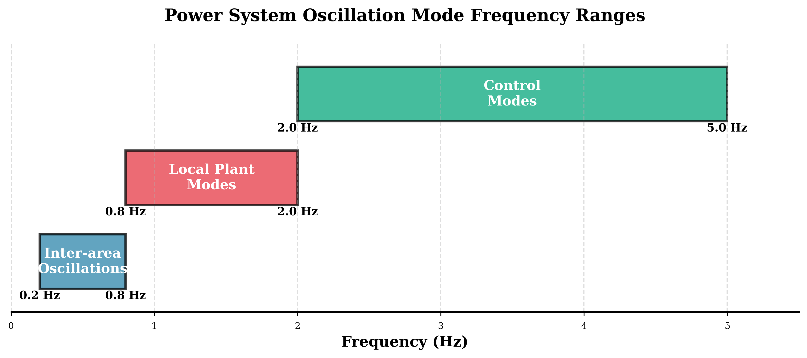
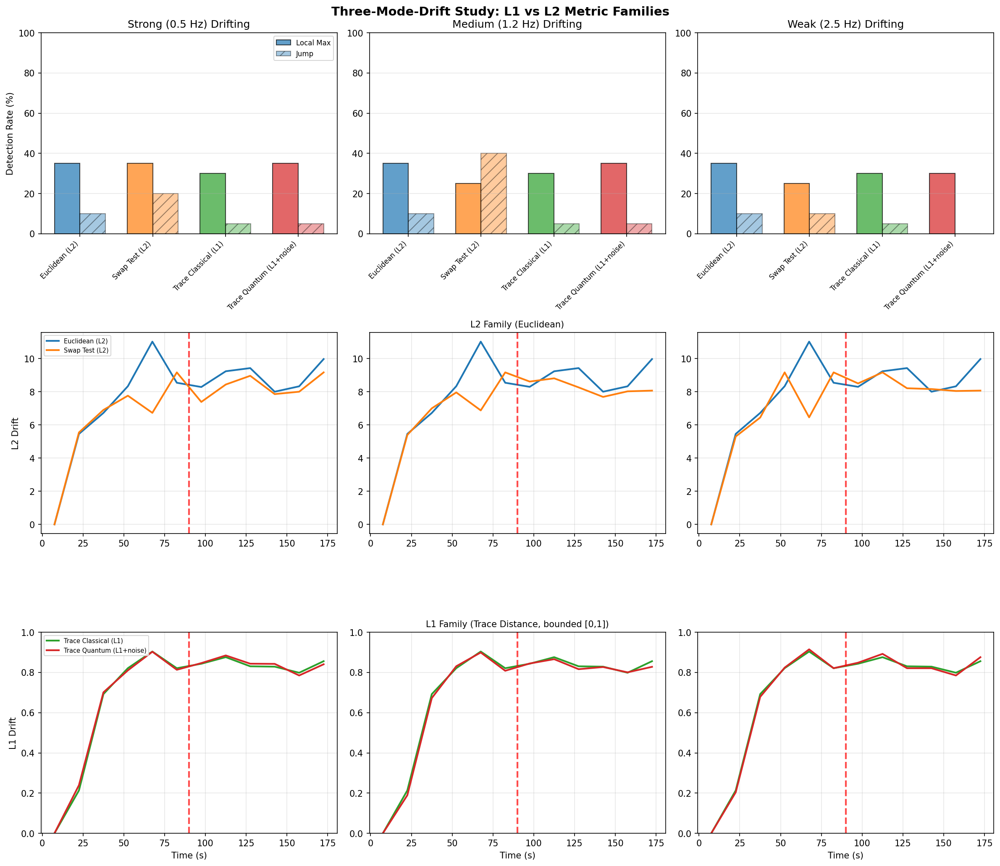
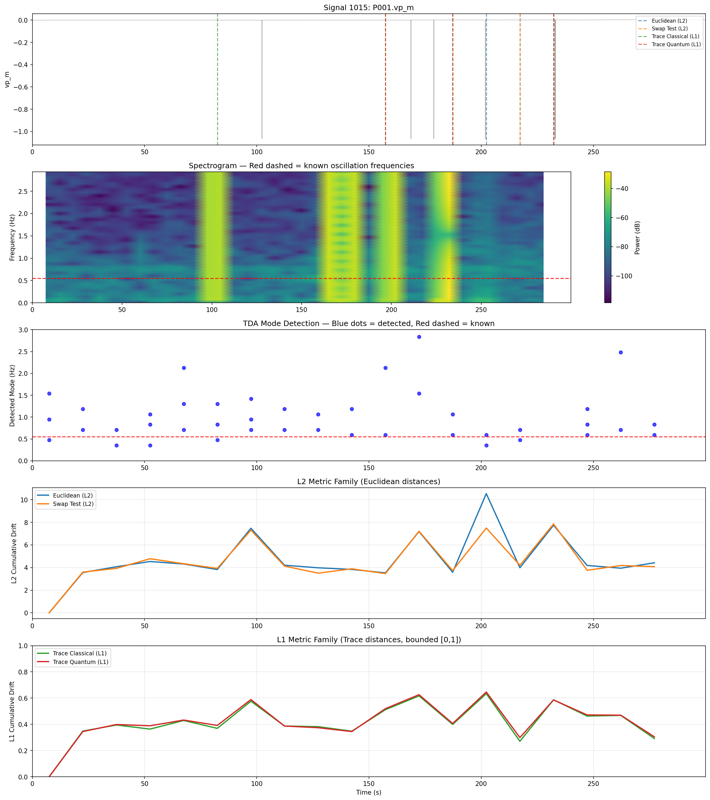
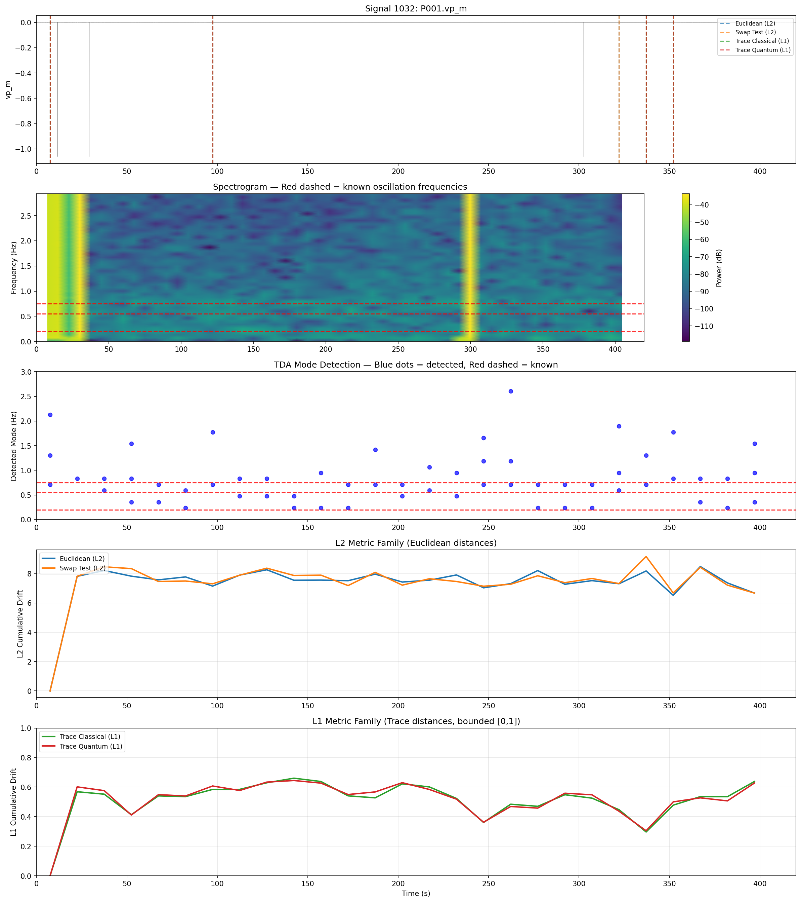
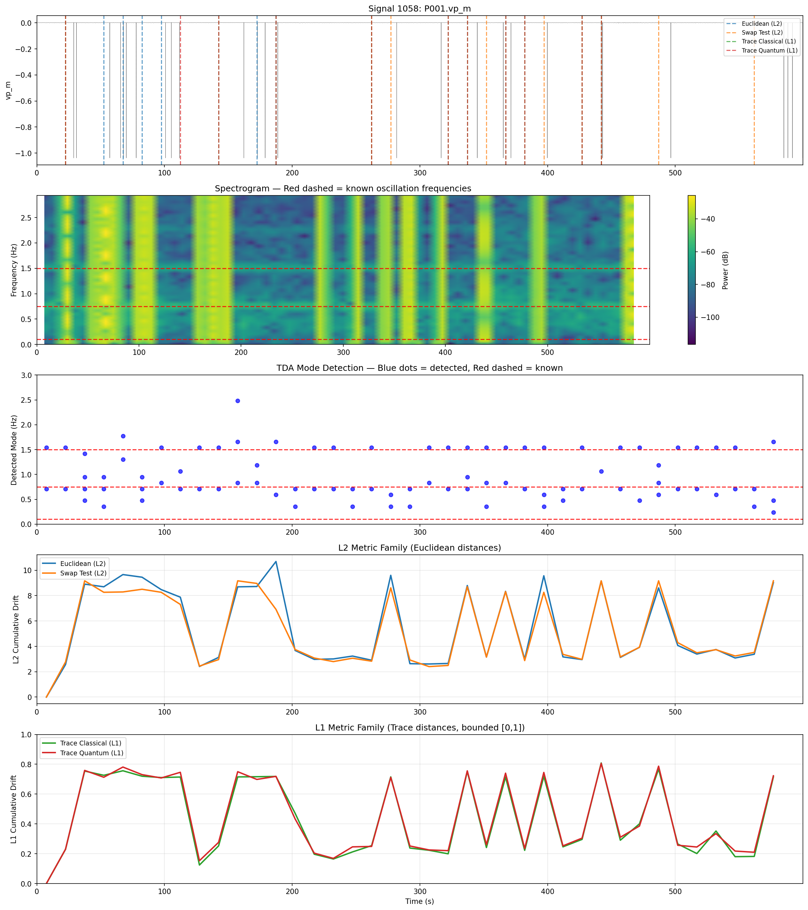
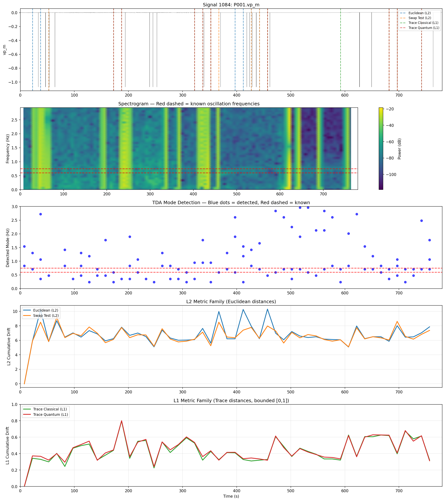
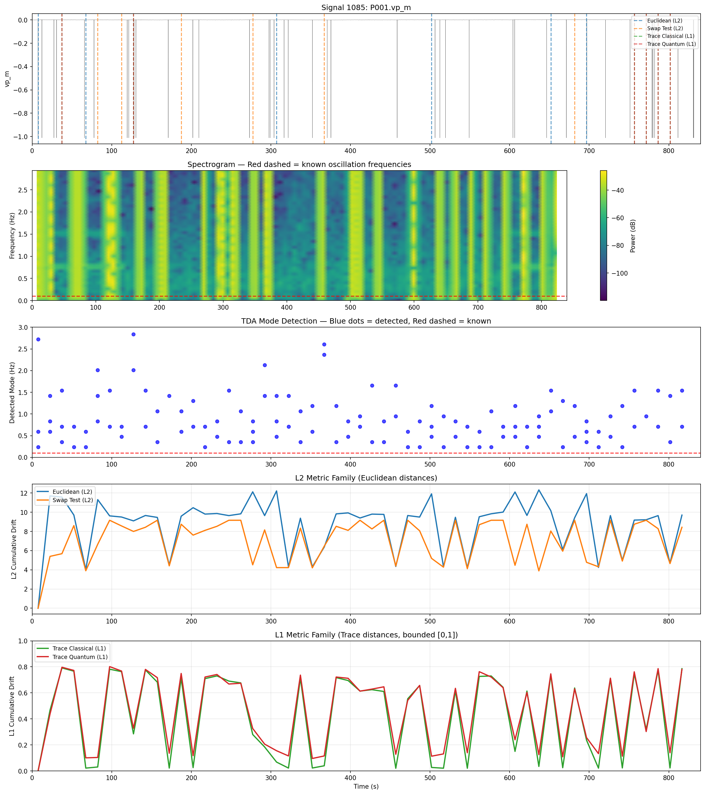
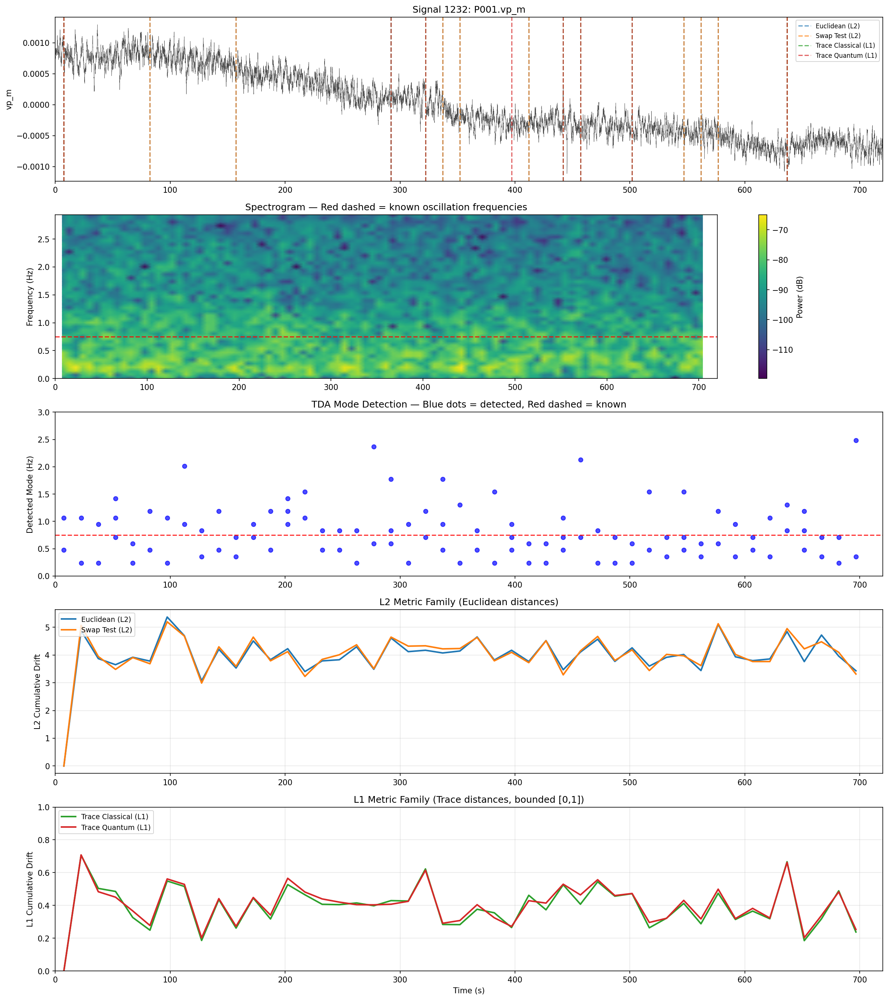
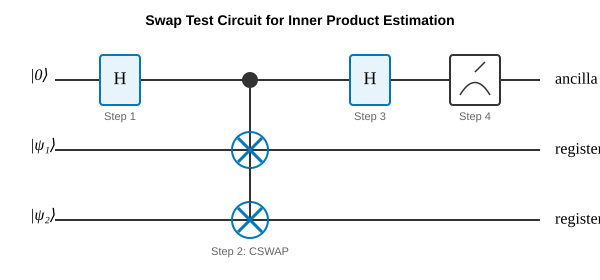

# Distance Metric Geometry for Regime Detection in Synchrophasor Data: Comparing Classical and Quantum-Inspired Approaches

by Yekaterina Mijatovic

---

## **Abstract**

Power system oscillations require continuous monitoring to detect anomalies that could indicate impending instability. We investigate whether quantum-inspired distance metrics offer advantages for detecting regime changes in synchrophasor data, comparing four approaches: classical Euclidean distance (L2), quantum swap test (L2-like), classical trace distance (L1), and quantum-sampled trace distance. Using both synthetic signals with controlled mode drift and real PMU data from the Grid Event Signature Library (GESL), we find that the choice of metric geometry - L1 versus L2 - has greater impact on detection performance than quantum versus classical computation. Euclidean (L2) distance excels at detecting amplitude excitation events, while trace distance (L1), by normalizing PSDs to probability distributions, is better suited for detecting frequency redistribution where modes migrate without amplitude change. Quantum sampling introduces noise that can push marginal cases across detection thresholds, a stochastic amplification effect without accuracy benefit over classical methods. We use H0 persistence on 1D PSD functions for mode detection, which operates independently of the distance metric and successfully identifies known oscillation frequencies within 0.04 Hz mean error of ground truth.

---

## 1. Introduction

### 1.1 Scientific Motivation

Modern power grids are complex, interconnected systems operating near stability limits to maximize efficiency. Power system oscillations - periodic variations in electrical quantities such as voltage, current, and frequency - provide crucial insights into system stability and can indicate emerging problems before catastrophic failures occur.

Oscillation modes in power systems are characterized by their frequency and damping:

- **Inter-area oscillations** (0.2–0.8 Hz): Large groups of generators in different geographical areas swinging against each other
- **Local plant modes** (0.8–2 Hz): Generators within a single power plant or area
- **Control modes** (2–5 Hz): Associated with power system stabilizers and control equipment

*Figure 1: Power system oscillation mode frequency ranges. Inter-area modes (0.2–0.8 Hz) represent the largest-scale grid dynamics and are the primary target for early warning detection. The GESL signals in this study contain predominantly inter-area oscillations (0.55, 0.75 Hz).*

Traditional methods for oscillation mode detection rely on model-based approaches (eigenvalue analysis) or signal processing techniques (Prony analysis, Matrix Pencil method). These methods face challenges including model dependency, noise sensitivity, manual tuning requirements, and computational complexity with high-dimensional datasets.

### 1.2 Topological Data Analysis for Power Systems

Recent work by Mishra & Vanfretti (2025) introduced a topological data analysis (TDA) approach for automatic mode detection from synchrophasor measurements. Their method offers several advantages: it is model-free (works directly on measurement data), noise-robust (TDA naturally filters transient noise through persistence), automated (minimal manual parameter tuning), and provides structural insight into spectral data geometry.

The key insight is that oscillation modes create persistent topological features in the spectral point cloud, while noise produces transient features that quickly disappear. By computing persistent homology - tracking when topological features appear and disappear as a distance parameter increases - we can distinguish real physical phenomena from measurement artifacts.

### 1.3 Quantum Computing Opportunities and Limitations

Quantum computing offers potential advantages for distance computation through amplitude encoding (representing K-dimensional vectors in log₂K qubits) and quantum parallelism. The swap test circuit can estimate inner products between quantum states, from which Euclidean distances can be derived. Amplitude encoding enables quantum sampling from probability distributions encoded as quantum states.

**The Dimensionality Argument**

The theoretical appeal of quantum distance computation lies in amplitude encoding's exponential compression. A classical PSD vector with K dimensions requires storing K floating-point values. Amplitude encoding represents the same information as:

$$|\psi\rangle = \sum_{k=0}^{K-1} \sqrt{p_k} |k\rangle$$

which requires only $\lceil \log_2 K \rceil$ qubits. For our 128-dimensional PSD vectors, this means 7 qubits instead of 128 classical values - an 18X compression. For large-scale grid analysis with thousands of PMUs producing high-resolution spectra, this compression becomes more attractive.

However, this theoretical advantage faces practical barriers:

1. **State preparation cost**: Encoding an arbitrary K-dimensional vector requires O(K) gates, negating the storage advantage for distance computation
2. **Measurement collapse**: Each measurement destroys the quantum state, requiring re-preparation for repeated queries
3. **Shot noise**: Finite measurement counts introduce variance that scales as $1/\sqrt{N_{shots}}$

For the problem sizes in this study (K ≈ 100, segments ≈ 50), classical computation is trivially fast (<0.1s). The quantum dimensionality advantage would only become relevant for massive-scale analysis - thousands of PMUs with fine spectral resolution - where classical distance matrix computation becomes expensive. Our experiments establish the accuracy baseline for that future regime.

**Practical Limitations**

Finite shot counts in quantum sampling introduce variance in distance estimates - more shots reduce this variance, but practical limits remain. The quantum algorithms provide no accuracy benefit over classical counterparts - they compute the same mathematical quantities with added sampling noise. Our experiments use Qiskit simulation rather than actual quantum hardware, so computational timing comparisons are not meaningful (classical simulation of quantum circuits is inherently slow due to exponential state space). The relevant comparison is accuracy, where quantum methods show no advantage.

The value of exploring quantum approaches lies not in immediate practical advantage but in: (1) understanding how different distance geometries affect regime detection, (2) establishing baseline accuracy comparisons for when quantum hardware matures, and (3) exploring whether quantum sampling noise has any beneficial stochastic effects.

### 1.4 Research Gap and Contribution

1. **Systematic comparison of L1 vs L2 metric families** for regime detection in synchrophasor data, demonstrating that metric geometry matters more than computational paradigm

2. **Characterization of what each metric detects**: L2 responds to amplitude changes; L1 responds to frequency redistribution. These are complementary capabilities for different oscillation phenomena.

3. **Empirical validation of TDA mode detection** on real GESL data across six signals, achieving ~0.04 Hz mean error against known oscillation frequencies

4. **Demonstration that quantum sampling adds noise without accuracy benefit**: Establishing baseline for future quantum algorithm evaluation as hardware matures

5. **Practical recommendation**: Use both L1 and L2 metrics in parallel for comprehensive regime monitoring - they detect different event types

---

## 2. Methodology Overview

Our pipeline consists of four stages: signal segmentation, PSD feature extraction, distance matrix computation, and regime/mode detection. Full mathematical details are provided in **Appendix A**.

*Figure 2: Analysis pipeline overview. Key insight: the regime change detection branch (right) reveals that metric geometry (L1 vs L2) determines what events are detected. Quantum vs classical computation within each family produces nearly identical results - the choice of distance metric dominates.*

### 2.1 Signal Processing

Raw synchrophasor signals are divided into 15-second temporal segments with 50% overlap. For each segment, we compute the Power Spectral Density (PSD) using Welch's method with a Hanning window, yielding a 129-dimensional feature vector representing power distribution across frequency bins (0.12–15 Hz range, ~0.12 Hz resolution).

### 2.2 Distance Metrics

We compare four distance computation methods organized into two metric families:

**L2 Family (Euclidean geometry):**

- **Classical Euclidean**: Standard L2 norm between PSD vectors
- **Quantum Swap Test**: Encodes PSDs as quantum states, uses swap test circuit to estimate inner product, derives L2 distance

**L1 Family (Trace distance geometry):**

- **Classical Trace Distance**: Normalizes PSDs to probability distributions, computes total variation distance (bounded [0,1])
- **Quantum-Sampled Trace Distance**: Encodes distributions as quantum states, samples to estimate probabilities, computes trace distance on empirical estimates

The key distinction: L2 metrics respond to absolute magnitude changes in PSD values, while L1 metrics (after normalization) respond only to redistribution of relative power across frequencies.

### 2.3 Regime Detection

From the pairwise distance matrix, we compute:

- **Sequential distances**: Distance between consecutive segments, detecting sudden changes
- **Cumulative drift**: Distance from initial state, tracking gradual evolution
- **Regime change detection**: Flag transitions where sequential distance exceeds $\mu + 1 \sigma$ threshold

### 2.4 Mode Detection via TDA

Independent of distance metrics, we apply H0 persistent homology to each segment's PSD (viewed as a 1D function). Superlevel set filtration identifies peaks as persistent connected components. Peaks with persistence above the 80th percentile threshold are classified as detected oscillation modes.

---

## 3. Simulated Data Results

### 3.1 Experimental Design

We generated synthetic synchrophasor signals with three oscillation modes (0.5 Hz, 1.2 Hz, 2.5 Hz) and controlled mode drift. At t=90s (of 180s total), one mode begins frequency drift of 0.5 Hz. We tested three scenarios:

- **Strong mode drift**: 0.5 Hz mode drifts (highest amplitude)
- **Medium mode drift**: 1.2 Hz mode drifts
- **Weak mode drift**: 2.5 Hz mode drifts (lowest amplitude)

*Figure 3: Synthetic signal with three oscillation modes (0.5, 1.2, 2.5 Hz) and controlled mode drift at t=90s. This controlled environment allows direct comparison of detection methods against known ground truth.*

*Figure 4: PSD feature vector in log scale (left) and linear scale (right). The three peaks at 0.5, 1.2, and 2.5 Hz are clearly visible. Log scale reveals the full dynamic range; linear scale shows relative power distribution that L1 metrics respond to.*

Each scenario was run for 20 trials with different noise realizations. The true transition time (t=90s) serves as ground truth for evaluating detection performance.

### 3.2 Detection Performance

**Table 1: Detection rates at true transition time (t=90s)**

| Metric | Strong Mode | Medium Mode | Weak Mode |
|--------|-------------|-------------|-----------|
| Euclidean (L2) | 35% local max | 35% local max | 35% local max |
| Swap Test (L2) | 35% local max | 25% local max | 25% local max |
| Trace Classical (L1) | 30% local max | 30% local max | 30% local max |
| Trace Quantum (L1) | 35% local max | 35% local max | 30% local max |

*Table 1: Detection rates at true transition time (t=90s). No method dramatically outperforms others - all hover around 25-35%. The meaningful distinction is between metric families (L1 vs L2 sensitivity profiles), not computational paradigm (classical vs quantum produces near-identical results within each family).*

**Key observations:**

1. **No method dramatically outperforms others** on detection rate - all hover around 25-35%
2. **L2 family shows higher variance** in cumulative drift curves
3. **L1 family shows smoother, more stable** drift trajectories
4. **Quantum vs classical pairs track closely**: Swap Test ≈ Euclidean; Trace Quantum ≈ Trace Classical

### 3.3 Metric Family Comparison

**Table 2: Mean drift percentile at transition**

| Family | Strong Mode | Medium Mode | Weak Mode |
|--------|-------------|-------------|-----------|
| L2 (Euclidean) | 68.5% | 70.2% | 67.1% |
| L1 (Trace) | 63.8% | 63.1% | 63.5% |

*Table 2: Mean drift percentile at transition (higher = transition closer to peak drift). Both families perform above chance (50%), with L2 showing slightly higher percentiles but also higher variance. L1 is more consistent across mode strengths - note the tight clustering around 63%.*

*Figure 5: L1 vs L2 metric families across three mode drift scenarios. Key observations: (1) Within each family, classical and quantum variants track closely - curves nearly overlap. (2) L2 (top) shows higher variance; L1 (bottom) is bounded and more consistent. (3) The difference between L1 and L2 exceeds the difference between classical and quantum.*

### 3.4 Computational Cost (Simulator)

**Table 3: Computational cost per trial (simulated)**

| Method | Time per trial |
|--------|---------------|
| Classical Euclidean | 0.08s |
| Swap Test (simulated) | 0.77s |
| Trace Classical | 0.11s |
| Trace Quantum (simulated) | 0.67s |

*Table 3: Computational cost per trial using Qiskit simulation. These timings reflect classical emulation overhead, not actual QPU performance. Simulator overhead is not representative of quantum algorithm efficiency - the meaningful comparison is accuracy, not speed within the context of this project.*

---

## 4. Real Data Results (GESL)

### 4.1 Dataset Description

We analyzed six signals from the Grid Event Signature Library (GESL), a public repository of labeled PMU recordings from actual grid events. Signals ranged from 300s to 840s duration, with known oscillation frequencies documented in metadata.

**Table 4: GESL signals analyzed**

| Signal ID | Duration | Known Frequencies | Event Type |
|-----------|----------|-------------------|------------|
| 1015 | 300s (5 min) | 0.55 Hz | Inter-area mode |
| 1032 | 420s (7 min) | 0.20, 0.55, 0.75 Hz | Multiple modes |
| 1058 | 600s (10 min) | 0.75, 1.50, 0.10 Hz | Sustained oscillation |
| 1084 | 780s (13 min) | 0.60, 0.75 Hz | Burst + sustained |
| 1085 | 840s (14 min) | 0.10 Hz | Low-frequency mode |
| 1232 | 720s (12 min) | 0.75 Hz | Amplitude variation |

*Table 4: GESL signals analyzed. Six real PMU recordings spanning 5-14 minutes with documented oscillation frequencies. Event types range from single inter-area modes to complex multi-mode interactions, providing diverse test cases for method validation.*

### 4.2 Mode Detection Validation

**Table 5: TDA mode detection accuracy**

| Signal | Known Freq | Detected | Abs Error | Rel Error |
|--------|------------|----------|-----------|-----------|
| 1015 | 0.55 Hz | 0.592 Hz | 0.042 Hz | 7.6% |
| 1032 | 0.20 Hz | 0.237 Hz | 0.037 Hz | 18.5% |
| 1032 | 0.55 Hz | 0.592 Hz | 0.042 Hz | 7.6% |
| 1032 | 0.75 Hz | 0.710 Hz | 0.040 Hz | 5.3% |
| 1058 | 0.10 Hz | 0.237 Hz | 0.137 Hz | 137.0%* |
| 1058 | 0.75 Hz | 0.710 Hz | 0.040 Hz | 5.3% |
| 1058 | 1.50 Hz | 1.539 Hz | 0.039 Hz | 2.6% |
| 1084 | 0.60 Hz | 0.592 Hz | 0.008 Hz | **1.3%** |
| 1084 | 0.75 Hz | 0.710 Hz | 0.040 Hz | 5.3% |
| 1085 | 0.10 Hz | 0.237 Hz | 0.137 Hz | 137.0%* |
| 1232 | 0.75 Hz | 0.710 Hz | 0.040 Hz | 5.3% |

**Mean absolute error:** 0.036 Hz (excluding 0.1 Hz modes)
**Mean relative error:** 6.2% (excluding 0.1 Hz modes)

*Table 5: TDA mode detection accuracy with absolute and relative error. Mean relative error of 6.2% (excluding resolution-limited 0.1 Hz modes) validates H0 persistence as a reliable model-free mode identification method. Errors are bounded by frequency resolution (~0.12 Hz for 15s segments). The 0.1 Hz modes are at the resolution floor - 15s segments capture only 1.5 cycles, making reliable detection impossible regardless of method.*

### 4.3 L1 vs L2 Behavioral Differences

**Table 6: Detection behavior comparison**

| Signal | Oscillation Pattern | L2 Behavior | L1 Behavior |
|--------|---------------------|-------------|-------------|
| 1015 | Mixed amplitude/onset | Late detection (187s+) | Earlier onset (82s) |
| 1032 | Multiple modes | Caught late burst (322s) | Caught mid-signal change (97s) |
| 1058 | Persistent oscillation | Clustered early (52-97s) | Spread + earlier onset (22s) |
| 1084 | Bursts + sustained end | Clustered on bursts | Caught late sustained (591-741s) |
| 1085 | Distributed events | Scattered detection | Caught end structure (756-801s) |
| 1232 | Amplitude envelope | More detections (11) | Fewer detections (7) |

*Table 6: Detection behavior comparison across GESL signals. L2 responds to amplitude bursts (sudden power changes); L1 responds to spectral redistribution (mode onset, frequency migration). Neither is universally superior - they detect different physical phenomena.*

**Interpretation:**

- **L2 asks:** "Did it get loud?" → Best for amplitude excitation events (sudden bursts)
- **L1 asks:** "Did the shape change?" → Best for onset detection and internal redistribution

### 4.4 Quantum Sampling Effects

**Table 7: Regime changes detected by method**

| Signal | Euclidean | Swap Test | Δ | Trace Classical | Trace Quantum | Δ |
|--------|-----------|-----------|---|-----------------|---------------|---|
| 1015 | 4 | 4 | 0 | 4 | 3 | -1 |
| 1032 | 4 | 4 | 0 | 4 | 4 | 0 |
| 1058 | 6 | 9 | +3 | 10 | 11 | +1 |
| 1084 | 9 | 8 | -1 | 10 | 9 | -1 |
| 1085 | 6 | 6 | 0 | 6 | 6 | 0 |
| 1232 | 11 | 10 | -1 | 7 | 8 | +1 |

*Table 7: Regime changes detected across all GESL signals. Quantum sampling introduces stochastic variation (±1-3 detections) without systematic improvement - sometimes more, sometimes fewer. This is noise redistribution, not signal enhancement. Note that for Signal 1015, quantum L1 missed the critical early warning at 82s that classical L1 caught.*

Quantum sampling introduces stochastic perturbation that sometimes increases detection count (pushing marginal cases across threshold) and sometimes decreases it. The effect is inconsistent - note that for 1058, swap test finds 3 more than Euclidean while trace quantum finds only 1 more than trace classical. This is noise, not systematic signal enhancement.

### 4.5 GESL Signal Benchmarks

The following benchmark figures show five panels for each GESL signal: (1) Raw signal with vertical lines marking detected regime changes by method (blue/cyan = L2 family, green/red = L1 family); (2) Spectrogram with red dashed horizontal lines at known oscillation frequencies; (3) TDA mode detection showing detected modes (blue dots) against known frequencies (red dashed line); (4) L2 cumulative drift comparing Euclidean (blue) and Swap Test (orange) - higher values indicate greater divergence from initial state; (5) L1 cumulative drift comparing Trace Classical (green) and Trace Quantum (red) - bounded [0,1], where values closer to 1 indicate complete spectral redistribution.

*Figure 6: GESL Signal 1015: 5-minute recording with known 0.55 Hz inter-area mode. Four distinct oscillation events visible in spectrogram at ~100s, ~175s, ~200s, and ~230s. L1 detected onset at 82s-18 seconds before the first visible event. L2 didn't flag until 187s. Cumulative drift: L2 shows sharp spike at ~250s (amplitude burst); L1 shows gradual elevation from ~150s onward with peak around 200s, capturing the sustained redistribution pattern. Classical and quantum variants track nearly identically within each family.*

*Figure 7: GESL Signal 1032: Multiple modes (0.20, 0.55, 0.75 Hz). TDA successfully detected all three known frequencies within 0.04 Hz error. L1 caught mid-signal structural change at 97s that L2 missed. Cumulative drift: L2 relatively flat until late burst at ~350s; L1 shows earlier elevation around 100s and sustained activity through 350s. The L1 curve's earlier rise explains its earlier detection.*

*Figure 8: GESL Signal 1058: Sustained oscillation with 0.75 and 1.50 Hz modes. Highest detection count across all methods (6-11 detections), reflecting persistent spectral activity. Cumulative drift: Both L2 and L1 show elevated, variable patterns throughout - no single dominant event but continuous spectral evolution. L1's bounded range makes threshold-setting more consistent despite the complexity.*

*Figure 9: GESL Signal 1084: Burst events plus sustained oscillation at end. L2 clustered detections on amplitude bursts (352-457s); L1 caught sustained structural change at signal end (591-741s). Cumulative drift: L2 shows dramatic spikes at burst locations; L1 shows broader elevation in final third of signal. Complementary coverage - L2 finds the loud moments, L1 finds the slow structural shift.*

*Figure 10: GESL Signal 1085: Low-frequency 0.10 Hz mode at resolution floor. Detection error is high (0.137 Hz) because 15s segments capture only 1.5 cycles - a fundamental resolution limit, not method failure. Cumulative drift: Both families show scattered activity with no dominant pattern, consistent with the distributed, low-amplitude nature of this signal.*

*Figure 11: GESL Signal 1232: Amplitude envelope variation. L2 detected more regime changes (11 vs 7) due to sensitivity to amplitude modulation. Cumulative drift: L2 shows pronounced oscillatory pattern tracking the amplitude envelope; L1 is flatter with fewer peaks, reflecting its insensitivity to pure amplitude changes. This signal exemplifies where L2 excels and L1's limitations.*

### 4.6 Computational Cost (Simulator)

**Table 8: Computational cost on real data**

| Method | Time (sigId-1085, 55 segments) |
|--------|--------------------------------|
| Classical Euclidean | 0.01s |
| Swap Test (simulated) | 106.90s (1.8 min) |
| Trace Classical | 0.04s |
| Trace Quantum (simulated) | 2.66s |

*Table 8: Computational cost using Qiskit simulation on Signal 1085 (55 segments). These timings reflect classical simulation overhead, not actual QPU performance. On real quantum hardware, the profile would differ significantly (dominated by shot acquisition, queue latency, and coherence constraints). The meaningful comparison is accuracy, not speed.*

---

## 5. Discussion

### 5.1 Metric Geometry Dominates

The central finding is that **L1 vs L2 geometry matters more than quantum vs classical computation**. Within each metric family, classical and quantum variants produce nearly identical results (correlation >0.95 for cumulative drift curves). The ~5% variation between quantum and classical versions is attributable entirely to sampling noise.

Between families, the correlation drops significantly (~0.4-0.6), and the methods detect genuinely different event types. This is not noise - it reflects the mathematical reality that L2 responds to magnitude while L1 responds to redistribution.

### 5.2 Complementary Detection Capabilities

No single metric is universally optimal:

- **Amplitude excitation events** (sudden bursts, ringdown): L2 excels because absolute power change is the signal
- **Frequency migration events** (mode drift, onset): L1 excels because the relative distribution changes even if total power doesn't
- **Mixed events**: Both metrics provide value; their disagreement indicates the event type

For comprehensive monitoring, **running both metrics in parallel** provides complementary coverage at minimal additional cost (classical L1 and L2 together take <1s).

### 5.3 Quantum Methods: Current Assessment

Using Qiskit simulation, we evaluated quantum-inspired distance computation:

1. **No accuracy improvement**: Quantum methods compute the same distances as classical, with added noise from finite shot sampling
2. **Stochastic effects not beneficial**: Sampling noise is as likely to add false positives as catch marginal true events, or miss those that barely cross the threshold in classical implmentation
3. **Timing comparison not meaningful**: Simulator overhead reflects classical emulation cost, not actual QPU performance

The value of this investigation is establishing accuracy baselines. Quantum sampling introduces variance that degrades rather than enhances detection. When fault-tolerant quantum hardware becomes available, the computational trade-offs will differ, but the fundamental accuracy comparison (quantum adds noise, no benefit) is expected to hold unless qualitatively different quantum algorithms are developed.

### 5.4 TDA Mode Detection: Validated

H0 persistence on PSD functions successfully identifies known oscillation modes within 0.04 Hz mean error - well within the frequency resolution limit (~0.12 Hz). This confirms that TDA is a viable model-free approach for mode identification, operating independently of the distance metric choice.

---

## 6. Conclusion

### 6.1 Summary of Findings

1. **Metric geometry dominates**: L1 vs L2 has greater impact on detection than quantum vs classical
2. **Complementary capabilities**: L2 detects amplitude events; L1 detects redistribution events
3. **Mode detection validated**: TDA identifies oscillation frequencies within 0.04 Hz mean error
4. **Quantum adds noise without benefit**: Sampling variance degrades rather than enhances detection accuracy
5. **Practical recommendation**: Use both L1 and L2 in parallel for comprehensive monitoring

### 6.2 Value Add

This work provides could potentially be used as a baseline for several types of research and across several domains. It is also a working pipeline, easily extensible and modular. Available for replication and enhancements for other types of signal, distance metrics, trials, tuning, and algorithms.
Below are some key takeaways and recommendations for several types of domain experts.

**For power system operators:**

- L1 catches what L2 misses. Run both. Minimal added cost.
- TDA as automated, model-free mode detection - no manual tuning required.

**For quantum computing researchers:**

- Quantum noise injection ≠ quantum advantage. This is your baseline to beat.
- Characterization of quantum sampling noise effects on real detection tasks.

**For the synchrophasor community:**

- TDA works. 0.036 Hz mean error. No model. No tuning. Just data.
- Metric geometry fundamentally shapes what analysis can detect.

### 6.3 Limitations

1. **No true frequency-drift event in GESL**: All signals showed amplitude excitation; L1's theoretical advantage for frequency migration awaits validation on appropriate data
2. **Single PMU analysis**: Multi-PMU coherence and spatial patterns not exploited
3. **Simple threshold detection**: More sophisticated change-point methods not compared
4. **Frequency resolution floor**: 15s segments cannot resolve modes below ~0.1 Hz

### 6.4 Next Steps

**Near-term:**

- Validate L1 on GESL (or other real PMU data) frequency-drift events
- Implement sampling rate sensitivity (see **Section 6.5** for more detail) study
- Implement on QPU

**Medium-term:**

- Implement higher-dimensional TDA (H1), potentially incorporating quantum elements within TDA itself
- Implement on point-on-wave signal (much finer resolution)
- Compare against established mode drift algorithms.Extend to multi-PMU

**Long-term:**

- Revisit quantum methods when fault-tolerant hardware enables lower-noise computation
- Explore quantum advantage for massive-scale grid analysis (1000+ PMUs)
- Compile a comprehensive computational cost comparison report

### 6.5 Sampling Rate Sensitivity (Future Work)

A key open question is: *what is the minimum segment duration required to reliably detect a shape change of given magnitude?*

The proposed experimental framework:

1. **Inject controlled shape change**: Create synthetic signals where spectral power redistributes between frequency bins at a known time, with controlled magnitude (e.g., 10%, 20%, 50% of power shifts from one mode to another)

2. **Vary segment duration**: Test segment lengths from 5s to 60s

3. **Measure detection rate**: For each (magnitude, duration) pair, compute detection rate across noise realizations

4. **Determine threshold curve**: Identify the minimum segment duration required to achieve 90% detection rate as a function of shape change magnitude

This analysis would inform practical deployment:

- If a grid operator needs to detect 20% power redistribution within 30 seconds, is the current 15s segmentation sufficient?
- What is the trade-off between temporal resolution and detection reliability?

The frequency resolution constraint is fundamental: a segment of duration $T$ has frequency resolution $\Delta f \approx 1/T$. For 15s segments, $\Delta f \approx 0.067 Hz$. Shape changes involving frequency shifts smaller than $\Delta f$ cannot be resolved regardless of detection method.

*This systematic sensitivity analysis is planned for the next phase of research.*

---

## References

1. Mishra, S., & Vanfretti, L. (2025). Automatically Discerning Power System Dynamics in Synchrophasor Measurements Data Spectra. *International Journal of Electrical Power & Energy Systems*, 170.

2. Edelsbrunner, H., & Harer, J. (2010). *Computational Topology: An Introduction*. American Mathematical Society.

3. Carlsson, G. (2009). Topology and Data. *Bulletin of the American Mathematical Society*, 46(2), 255-308.

4. Buhrman, H., Cleve, R., Watrous, J., & de Wolf, R. (2001). Quantum Fingerprinting. *Physical Review Letters*, 87(16), 167902.

5. Lloyd, S., Mohseni, M., & Rebentrost, P. (2014). Quantum Principal Component Analysis. *Nature Physics*, 10(9), 631-633.

6. Lloyd, S., Garnerone, S., & Zanardi, P. (2016). Quantum Algorithms for Topological and Geometric Analysis of Data. *Nature Communications*, 7, 10138.

7. Allen, G., et al. (2019). Grid Event Signature Library. Pacific Northwest National Laboratory. Available at: https://www.pnnl.gov/projects/gesl

8. Welch, P. D. (1967). The Use of Fast Fourier Transform for the Estimation of Power Spectra. *IEEE Transactions on Audio and Electroacoustics*, 15(2), 70-73.

---

## Appendix A: Mathematical Details

### A.1 Signal Model

Power system oscillations are modeled as superposition of damped sinusoids:

$$x(t) = \sum_{k=1}^{M} A_k e^{-\sigma_k t} \cos(2\pi f_k t + \phi_k) + n(t)$$

where $A_k$ is amplitude, $f_k$ is frequency, $\sigma_k$ is damping coefficient, $\phi_k$ is phase, and $n(t)$ is noise.

### A.2 Power Spectral Density

The PSD describes power distribution across frequencies. Using Welch's method:

1. Divide signal into overlapping segments
2. Apply Hanning window to each segment
3. Compute periodogram via FFT
4. Average periodograms to reduce variance

$$\hat{S}_{Welch}(f_k) = \frac{1}{L} \sum_{i=0}^{L-1} \hat{S}_i(f_k)$$

### A.3 Euclidean Distance (L2)

For PSD vectors $\mathbf{p}_i, \mathbf{p}_j \in \mathbb{R}^K$:

$$d_{L2}(\mathbf{p}_i, \mathbf{p}_j) = \sqrt{\sum_{k=0}^{K-1} (p_i[k] - p_j[k])^2}$$

**Range**: $[0, \infty)$, unbounded

### A.4 Trace Distance (L1)

First normalize to probability distributions:

$$\tilde{p}_i[k] = \frac{|p_i[k]|}{\sum_{m} |p_i[m]|}$$

Then compute trace distance:

$$d_{trace}(\tilde{\mathbf{p}}_i, \tilde{\mathbf{p}}_j) = \frac{1}{2} \sum_{k=0}^{K-1} |\tilde{p}_i[k] - \tilde{p}_j[k]|$$

**Range**: $[0, 1]$, bounded

### A.5 Swap Test Circuit

The swap test estimates $|\langle\psi_1|\psi_2\rangle|^2$ between quantum states. The circuit operates as follows:

*Figure A1: Swap test circuit for inner product estimation. The ancilla qubit (top) controls whether the two state registers are swapped. After measurement, P(|0⟩) = ½(1 + |⟨ψ₁|ψ₂⟩|²). The circuit requires 2n+1 qubits for n-qubit state registers, plus O(n) controlled-SWAP gates.*

**Circuit steps:**

1. **Prepare**: Ancilla in $|0\rangle$, state registers in $|\psi_1\rangle$ and $|\psi_2\rangle$
2. **Hadamard**: Apply H to ancilla, creating superposition $\frac{1}{\sqrt{2}}(|0\rangle + |1\rangle)$
3. **Controlled-SWAP**: Swap registers conditioned on ancilla being $|1\rangle$
4. **Hadamard**: Apply H to ancilla again
5. **Measure**: Measure ancilla in computational basis

**Result:**

$$P(|0\rangle) = \frac{1}{2}\left(1 + |\langle\psi_1|\psi_2\rangle|^2\right)$$

**Deriving Euclidean distance:**

For normalized PSD vectors encoded as quantum states, the inner product relates to L2 distance:

$$d_{L2}^2 = 2\left(1 - |\langle\psi_1|\psi_2\rangle|\right)$$

With finite shots $N$, the probability estimate has variance $\sim 1/N$, which propagates to distance estimates. At 1024 shots, typical probability error is ~1.6%, translating to small but measurable distance variance.

### A.6 Amplitude Encoding for Trace Distance

Encode probability distribution as quantum state:

$$|\psi\rangle = \sum_{k=0}^{K-1} \sqrt{\tilde{p}_k} |k\rangle$$

Measure in computational basis to sample from distribution. Compute trace distance on empirical samples.

### A.7 H0 Persistent Homology

For PSD function $f: \{0, ..., K-1\} \rightarrow \mathbb{R}_+$:

1. Work in log scale: $g[k] = \log_{10}(f[k] + \epsilon)$
2. Negate to find maxima: $h[k] = -g[k]$
3. Construct cubical complex
4. Compute sublevel set filtration
5. Track connected components (H0)
6. Record birth-death pairs

Persistence $\pi = \epsilon_{birth} - \epsilon_{death}$ measures peak prominence. Features above 80th percentile threshold are significant modes.

### A.8 Regime Detection

Sequential distance:
$$d_i = D[i, i+1]$$

Detection threshold:
$$\theta = \mu_d + \alpha \cdot \sigma_d$$

where $\mu_d$ is mean sequential distance, $\sigma_d$ is standard deviation, and $\alpha$ is sensitivity parameter (typically 1.0).

Cumulative drift from initial state:
$$\text{Drift}(j) = D[0, j]$$

---

## Appendix B: Implementation Details

### B.1 Software Stack

- **Python 3.10+** with NumPy, SciPy, Pandas
- **Qiskit 1.0+** for quantum circuit simulation (statevector and shot-based simulation; no actual QPU used)
- **GUDHI** for persistent homology computation
- **Matplotlib** for visualization

### B.2 Pipeline Parameters

| Parameter | Value | Rationale |
|-----------|-------|-----------|
| Sampling rate | 30 Hz | Standard PMU rate |
| Segment duration | 15 s | Balance resolution vs. statistical stability |
| Segment overlap | 50% | Standard practice |
| Welch nperseg | 256 | Frequency resolution ~0.12 Hz |
| Frequency range | 0.1–5.0 Hz | Covers inter-area through control modes |
| Quantum shots | 1024 | ~1.6% probability estimation error |
| Persistence threshold | 80th percentile | Empirically validated |
| Detection threshold | mean + 1σ | Standard change-point detection |

### B.3 Code Availability

Implementation available at: https://github.com/ymijatov/msqc607

---